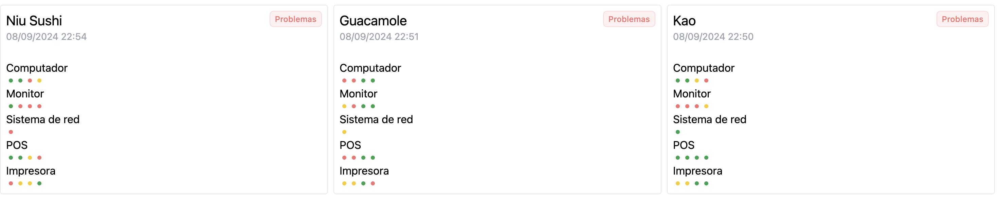
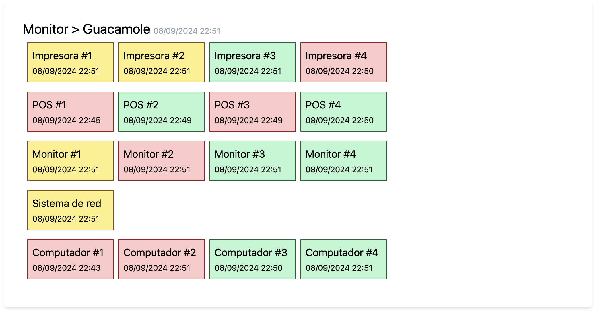
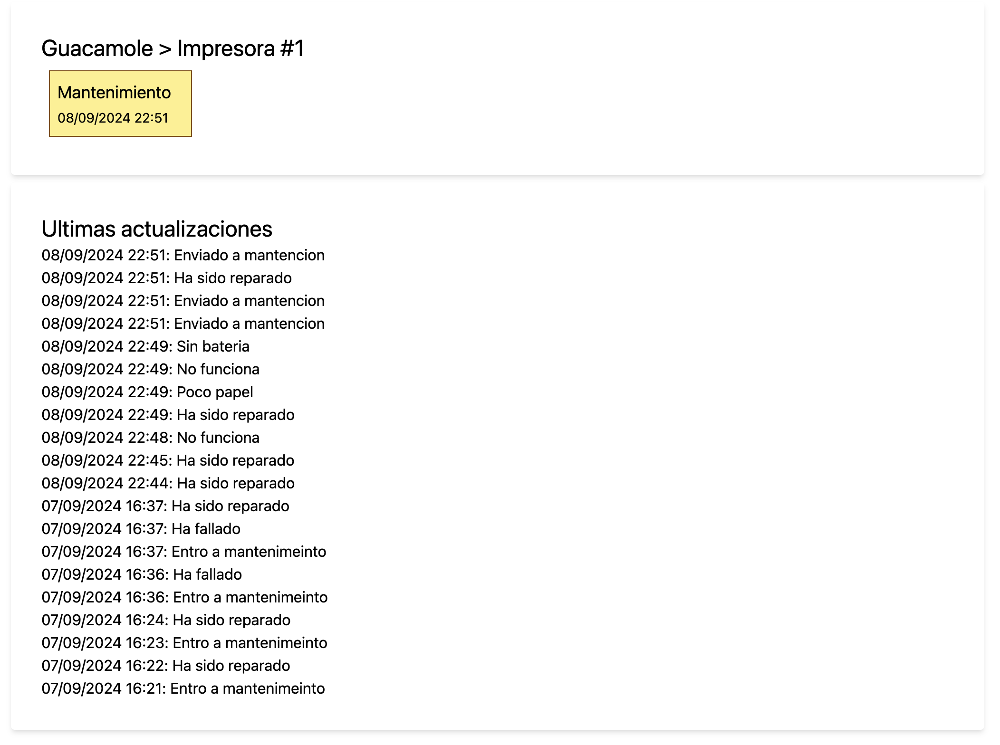

# Prueba API Monitor

## Aplicacion
### Versiones
Ruby 3.1.2

Rails 7.2.1
PostgreSQL 14.2
Node 21.4.0


### Descripcion
Aplicacion para monitorear el estado de dispositivos utilizados en cada restaurante, en su pagina de inicio se ve un listado de restaurantes, con un detalle del estado de cada dispositivo asociado a este.
Cada restaurante tiene un estado segun la cantidad de dispositivos funcionando:

    - Operativo: El restaurante tiene todos sus dispositivos funcionando

    - Advertencia: El restaurante tiene algunos dispositivos en mantencion o fuera de funcionamiento.

    - Problemas: El restaurante tiene el total de algun tipo de dispositivo en mantencion o dañados.

Y cada dispositivo tiene 3 estados posibles: Funcionando (verde), en mantencion (amarillo) y dañado (rojo).
Para actualizar el estado de cada dispositivo se debe hacer una peticion tipo POST a la API en la direccion http:localhost:3000/api/v1/devices enviando como parametros su identificador, estado y un mensaje opcional:
```
{
    device: {
        id: integer,
        status: string,
        message(optional): string,
    }
}
```
Al recibir el cambio de estado, se creara un registro del cambio de estado y la aplicacion actualizara el estado del restaurante y dispositivo automaticamente y se podra ver un detalle de cada actualizacion del dispositvo.

La aplicacion se cargara automaticamente con 3 restaurantes y 16 dispositivos creados para cada uno. Cada dispositivo pertenece a una categoria preestablecida, estas podran ser:
- POS (4)
- Computador  (4)
- Monitor  (4)
- Impresora  (4)
- Sistema de red  (1)

En primera instancia todos los dispositivos estaran en funcionamiento (estado: working).


### Endpoints

### GET http://localhost:3000

Vista de los restaurantes mostrando un detalle del estado de sus dispositivos, esta se actualiza automaticamente despues de cada actualizacion del dispositivo.

### GET http://localhost:3000/restaurants/:id

Vista del restaurante mostrando cada dispositivo, su estado y la fecha de la ultima actualizacion, esta se actualiza automaticamente despues de cada actualizacion del dispositivo.

### GET http://localhost:3000/devices/:id

Vista del dispositivo mostrando un listado de sus ultimas actualizaciones y su fecha correspondiente, esta se actualiza automaticamente despues de cada actualizacion del dispositivo.

### POST http://localhost:3000/api/v1/devices
 Recibe el estado de un dispositivo y crea un registro en la base de datos

 Parametros:

| Parametro    | Valor |
| -------- | ------- |
| id(integer)  | Identificador del dispositivo (ej: 1)   |
| status(string) | Estado del dispositivo (working, maintenance, broken)     |
| message(string) | (opcional) Mensaje para que quede registrado en el centro de monitoreo     |


## Uso
### API para monitorear dispositivos
Clonar repositorio
```
git clone git@test.com
```

ingresar al directorio de la aplicacion clonada
```
cd api_monitor
```

Crear, migrar y cargar la base de datos
```
bin/rails db:create
bin/rails db:migrate
bin/rails db:seed
```
Instalar dependencias
```
bundle install
npm install
```

Arrancar la aplicacion
```
bin/dev
```

Esto dejara la aplicaion funcionando y podra visitarse en http://localhost:3000, donde se vera un estado de los dispositivos de cada restaurante.

### Script para simular restaurantes
Para probar la aplicacion, hay un script en la carpeta lib/tasks, donde se simularan peticiones a la API informando del estado de cada dispositivo.
Esta peticion POST consiste en enviar un objeto device con su id y nuevo estado (:working, :maintenance, :broken):
```
device: {
    id: integer,
    status: string
}
```

Este script simulara el envio de estado de los dispositivos cada 1 segundo eligiendo aleatoriamente el dispositivo y el estado.

Para correr el script utilizar este comando en la carpeta raiz de la aplicacion:
```
rake simulator:run
```


Con este comando puedes simular el funcionamiento de un restaurant en especifico, cambia 1 por el id del restaurante.
```
rake 'simulator:restaurant[1]'
```


Con este comando puedes simular el funcionamiento de un dispositivo en especifico, cambia '1' por el id del dispositivo.
```
rake 'simulator:device[1]'
```

